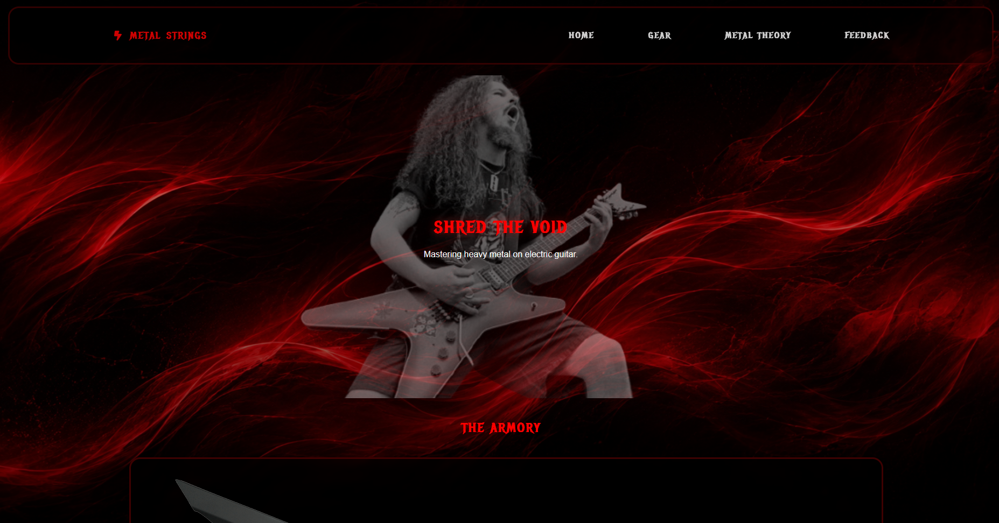

# 🎸 Heavy Metal Website 🤘

A sleek, responsive frontend website dedicated to all things heavy metal. 

## 🔗 Live Demo
Check out the live website here: https://4c3x-hexus.github.io/metal-website/

---

## 📋 Project Description
This website serves as a digital hub for metalheads. It features:
* **Dynamic UI:** High-contrast, dark-themed interface fitting the metal aesthetic.
* **Responsive Design:** Fully optimized for mobile, tablet, and desktop viewing.
* **Tech Stack:** React, HTML5, CSS3, JavaScript.

---

## ⚙️ Setup Instructions

To run this project locally, type these commands into your terminal:

1. Clone the repository:
   git clone https://github.com/4c3x-hexus/metal-website.git

2. Navigate into the project directory:
   cd metalsstrings

3. Install dependencies:
   npm install

4. Run the project locally:
   npm start

---

## 📸 Screenshots of the UI

### Desktop View
